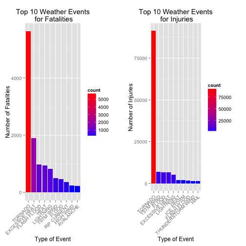

## Synopsis

Storms and other severe weather events can cause both public health and economic problems for communities and municipalities. Many severe events can result in fatalities, injuries, and property damage, and preventing such outcomes to the extent possible is a key concern.

This project involves exploring the U.S. National Oceanic and Atmospheric Administration's (NOAA) storm database. This database tracks characteristics of major storms and weather events in the United States, including when and where they occur, as well as estimates of any fatalities, injuries, and property damage.The events in the database start in the year 1950 and end in November 2011. In the earlier years of the database there are generally fewer events recorded, most likely due to a lack of good records. More recent years should be considered more complete.

In particular, we are concerned in answering the following questions:

1. Across the United States, which types of events (as indicated in the EVTYPE variable) are most harmful with respect to population health?
2. Across the United States, which types of events have the greatest economic consequences?

## Data Processing

The data that we will use for the analysis can be downloaded from the following [link](https://d396qusza40orc.cloudfront.net/repdata%2Fdata%2FStormData.csv.bz2). The code below checks if the data has been downloaded. If not, it downloads it and saves it in the current directory. The data is then read into R and store for future use.


```r
# Check if dataset already exists
if (!file.exists("StormData.csv.bz2")) {
    fileURL <- 'https://d396qusza40orc.cloudfront.net/repdata%2Fdata%2FStormData.csv.bz2'
    download.file(fileURL, destfile='StormData.csv.bz2', method = 'curl')
}

# Read data
stormData <- read.csv(bzfile("StormData.csv.bz2"))

# Record date of download
downloadedData <- date()
```

For this analysis, the data was downloaded on Wed Nov 19 23:43:43 2014.

The data consists of **902297** observations, each with **37** variables. The names of each of the variables are:


```r
names(stormData)
```

```
##  [1] "STATE__"    "BGN_DATE"   "BGN_TIME"   "TIME_ZONE"  "COUNTY"    
##  [6] "COUNTYNAME" "STATE"      "EVTYPE"     "BGN_RANGE"  "BGN_AZI"   
## [11] "BGN_LOCATI" "END_DATE"   "END_TIME"   "COUNTY_END" "COUNTYENDN"
## [16] "END_RANGE"  "END_AZI"    "END_LOCATI" "LENGTH"     "WIDTH"     
## [21] "F"          "MAG"        "FATALITIES" "INJURIES"   "PROPDMG"   
## [26] "PROPDMGEXP" "CROPDMG"    "CROPDMGEXP" "WFO"        "STATEOFFIC"
## [31] "ZONENAMES"  "LATITUDE"   "LONGITUDE"  "LATITUDE_E" "LONGITUDE_"
## [36] "REMARKS"    "REFNUM"
```

The class of each of the variables is summarized below:


```r
str(stormData)
```

```
## 'data.frame':	902297 obs. of  37 variables:
##  $ STATE__   : num  1 1 1 1 1 1 1 1 1 1 ...
##  $ BGN_DATE  : Factor w/ 16335 levels "1/1/1966 0:00:00",..: 6523 6523 4242 11116 2224 2224 2260 383 3980 3980 ...
##  $ BGN_TIME  : Factor w/ 3608 levels "000","0000","0001",..: 152 167 2645 1563 2524 3126 122 1563 3126 3126 ...
##  $ TIME_ZONE : Factor w/ 22 levels "ADT","AKS","AST",..: 6 6 6 6 6 6 6 6 6 6 ...
##  $ COUNTY    : num  97 3 57 89 43 77 9 123 125 57 ...
##  $ COUNTYNAME: Factor w/ 29601 levels "","5NM E OF MACKINAC BRIDGE TO PRESQUE ISLE LT MI",..: 13513 1873 4598 10592 4372 10094 1973 23873 24418 4598 ...
##  $ STATE     : Factor w/ 72 levels "AK","AL","AM",..: 2 2 2 2 2 2 2 2 2 2 ...
##  $ EVTYPE    : Factor w/ 985 levels "   HIGH SURF ADVISORY",..: 826 826 826 826 826 826 826 826 826 826 ...
##  $ BGN_RANGE : num  0 0 0 0 0 0 0 0 0 0 ...
##  $ BGN_AZI   : Factor w/ 35 levels "","  N"," NW",..: 1 1 1 1 1 1 1 1 1 1 ...
##  $ BGN_LOCATI: Factor w/ 54429 levels ""," Christiansburg",..: 1 1 1 1 1 1 1 1 1 1 ...
##  $ END_DATE  : Factor w/ 6663 levels "","1/1/1993 0:00:00",..: 1 1 1 1 1 1 1 1 1 1 ...
##  $ END_TIME  : Factor w/ 3647 levels ""," 0900CST",..: 1 1 1 1 1 1 1 1 1 1 ...
##  $ COUNTY_END: num  0 0 0 0 0 0 0 0 0 0 ...
##  $ COUNTYENDN: logi  NA NA NA NA NA NA ...
##  $ END_RANGE : num  0 0 0 0 0 0 0 0 0 0 ...
##  $ END_AZI   : Factor w/ 24 levels "","E","ENE","ESE",..: 1 1 1 1 1 1 1 1 1 1 ...
##  $ END_LOCATI: Factor w/ 34506 levels ""," CANTON"," TULIA",..: 1 1 1 1 1 1 1 1 1 1 ...
##  $ LENGTH    : num  14 2 0.1 0 0 1.5 1.5 0 3.3 2.3 ...
##  $ WIDTH     : num  100 150 123 100 150 177 33 33 100 100 ...
##  $ F         : int  3 2 2 2 2 2 2 1 3 3 ...
##  $ MAG       : num  0 0 0 0 0 0 0 0 0 0 ...
##  $ FATALITIES: num  0 0 0 0 0 0 0 0 1 0 ...
##  $ INJURIES  : num  15 0 2 2 2 6 1 0 14 0 ...
##  $ PROPDMG   : num  25 2.5 25 2.5 2.5 2.5 2.5 2.5 25 25 ...
##  $ PROPDMGEXP: Factor w/ 19 levels "","+","-","0",..: 16 16 16 16 16 16 16 16 16 16 ...
##  $ CROPDMG   : num  0 0 0 0 0 0 0 0 0 0 ...
##  $ CROPDMGEXP: Factor w/ 9 levels "","0","2","?",..: 1 1 1 1 1 1 1 1 1 1 ...
##  $ WFO       : Factor w/ 542 levels ""," CI","$AC",..: 1 1 1 1 1 1 1 1 1 1 ...
##  $ STATEOFFIC: Factor w/ 250 levels "","ALABAMA, Central",..: 1 1 1 1 1 1 1 1 1 1 ...
##  $ ZONENAMES : Factor w/ 25112 levels "","                                                                                                                               "| __truncated__,..: 1 1 1 1 1 1 1 1 1 1 ...
##  $ LATITUDE  : num  3040 3042 3340 3458 3412 ...
##  $ LONGITUDE : num  8812 8755 8742 8626 8642 ...
##  $ LATITUDE_E: num  3051 0 0 0 0 ...
##  $ LONGITUDE_: num  8806 0 0 0 0 ...
##  $ REMARKS   : Factor w/ 436781 levels "","\t","\t\t",..: 1 1 1 1 1 1 1 1 1 1 ...
##  $ REFNUM    : num  1 2 3 4 5 6 7 8 9 10 ...
```

From the structure of the data, we can observe that the variables **EVTYPE** (type of event), **FATALITIES** (number of fatalities), and **INJURIES** (number of injuries) are ready to be used for analysis. First, we activate the libraries `dplyr`, `ggplot2` and `gridExtra`. Then we count the number of fatalities and injuries based on the type of event, arrange them in descending order, and store them in two different data frames. From each, we select only the top 10 causes for visualization purposes.


```r
library(dplyr)
library(ggplot2)
library(gridExtra)

fatalities <- stormData %>%
    group_by(EVTYPE) %>%
    summarise(count = sum(FATALITIES)) %>%
    arrange(desc(count))
fatalities <- fatalities[1:10, ]

injuries <- stormData %>%
    group_by(EVTYPE) %>%
    summarise(count = sum(INJURIES)) %>%
    arrange(desc(count))
injuries <- injuries[1:10, ]
```

However, the variables **PROPDMG** (property damage), **PROPDMGEXP** (property damage exponential), **CROPDMG** (crop damage) and **CROPDMGEXP** (crop damage exponential) require some processing before they can be used for analysis. These four variables work in the following way: tha variables **PROPDMGEXP** and **CROPDMGEXP** contain the number of zeros that follow the quantities stored in the variables **PROPDMG** and **CROPDMG**. First, let's work with the variables **PROPDMG** and **PROPDMGEXP**. A summary on the variable **PROPDMGEXP** shows us the following:


```r
with(stormData, summary(PROPDMGEXP))
```

```
##             +      -      0      1      2      3      4      5      6 
## 465934      5      1    216     25     13      4      4     28      4 
##      7      8      ?      B      H      K      M      h      m 
##      5      1      8     40      6 424665  11330      1      7
```

Apart from the numbers 0-8, there are a couple of letters and symbols. Here H (or h) represents an exponent of 2, K (or k) and exponent of 3, M (or m) an exponent of 6, and B (or b) an exponent of 9. We transform these using the following code, which create a new variable called **TOTAL.COST.PROP**:


```r
# Set all exponents to zero
exponents <- vector(mode = "numeric", length = dim(stormData)[1])

# Check for different patterns and assign the corresponding value
exponents[stormData$PROPDMGEXP == "1"] <- 1
exponents[stormData$PROPDMGEXP == "H" | stormData$PROPDMGEXP == "h" | stormData$PROPDMGEXP == "2"] <- 2
exponents[stormData$PROPDMGEXP == "K" | stormData$PROPDMGEXP == "k" | stormData$PROPDMGEXP == "3"] <- 3
exponents[stormData$PROPDMGEXP == "4"] <- 4
exponents[stormData$PROPDMGEXP == "5"] <- 5
exponents[stormData$PROPDMGEXP == "M" | stormData$PROPDMGEXP == "m" | stormData$PROPDMGEXP == "6"] <- 6
exponents[stormData$PROPDMGEXP == "7"] <- 7
exponents[stormData$PROPDMGEXP == "8"] <- 8
exponents[stormData$PROPDMGEXP == "B" | stormData$PROPDMGEXP == "b"] <- 9
stormData <- stormData %>%
    mutate(TOTAL.COST.PROP = PROPDMG * 10 ^ exponents)
```

We repeat the process for the variables **CROPDMG** and **CROPDMGEXP**.


```r
with(stormData, summary(CROPDMGEXP))
```

```
##             0      2      ?      B      K      M      k      m 
## 618413     19      1      7      9 281832   1994     21      1
```


```r
# Set all exponents to zero
exponents <- vector(mode = "numeric", length = dim(stormData)[1])

# Check for different patterns and assign the corresponding value
exponents[stormData$CROPDMGEXP == "1"] <- 1
exponents[stormData$CROPDMGEXP == "H" | stormData$CROPDMGEXP == "h" | stormData$CROPDMGEXP == "2"] <- 2
exponents[stormData$CROPDMGEXP == "K" | stormData$CROPDMGEXP == "k" | stormData$CROPDMGEXP == "3"] <- 3
exponents[stormData$CROPDMGEXP == "4"] <- 4
exponents[stormData$CROPDMGEXP == "5"] <- 5
exponents[stormData$CROPDMGEXP == "M" | stormData$CROPDMGEXP == "m" | stormData$CROPDMGEXP == "6"] <- 6
exponents[stormData$CROPDMGEXP == "7"] <- 7
exponents[stormData$CROPDMGEXP == "8"] <- 8
exponents[stormData$CROPDMGEXP == "B" | stormData$CROPDMGEXP == "b"] <- 9
stormData <- stormData %>%
    mutate(TOTAL.COST.CROP = CROPDMG * 10 ^ exponents)
```

Using these new variables, we can summarize the information based on the type of event and store them in new data frames. Only the top 10 causes for visualization purposes.


```r
total.cost.PROP <- stormData %>% 
    count(EVTYPE, wt = TOTAL.COST.PROP, sort = TRUE) %>% 
    slice(1:10) %>%
    mutate(n = n / 1e9)
names(total.cost.PROP) <- c("EVTYPE", "Cost")

total.cost.CROP <- stormData %>% 
    count(EVTYPE, wt = TOTAL.COST.CROP, sort = TRUE) %>% 
    slice(1:10) %>%
    mutate(n = n / 1e9)
names(total.cost.CROP) <- c("EVTYPE", "Cost")
```

## Results

### Across the United States, which types of events (as indicated in the EVTYPE variable) are most harmful with respect to population health?

Using the data frames `fatalities` and `injuries` created in the previous section, we can obtain the following histograms. Both histograms agree that the weather event with more fatalities and injuries are **Tornadoes** with 5633 fatalities and 91346 injuries respectively.


```r
fatalitiesPlot <- ggplot(data = fatalities, aes(x = reorder(EVTYPE, rev(count)), y = count)) + 
    geom_bar(stat = "identity", aes(fill = count)) +
    scale_fill_continuous(low = "blue", high = "red") +
    theme(axis.text.x = element_text(angle = 45, hjust = 1)) +
    ylab("Number of Fatalities") +
    xlab("Type of Event") +
    ggtitle("Top 10 Weather Events\n for Fatalities")

injuriesPlot <- ggplot(data = injuries, aes(x = reorder(EVTYPE, rev(count)), y = count)) + 
    geom_bar(stat = "identity", aes(fill = count)) +
    scale_fill_continuous(low = "blue", high = "red") +
    theme(axis.text.x = element_text(angle = 45, hjust = 1)) +
    ylab("Number of Injuries") +
    xlab("Type of Event") +
    ggtitle("Top 10 Weather Events\n for Injuries")

grid.arrange(fatalitiesPlot, injuriesPlot, ncol = 2)
```

 

### Across the United States, which types of events have the greatest economic consequences?

Using the data frames `total.cost.PROP` and `total.cost.CROP` created in the previous section, we can obtain the following histograms. In the first one we can observe that the most serious weather event for property damage have been **Floods** with a cost ascending to 144 billion dollars. On the other hand, the most serious weather event for crop damage has been **Drought** with a damage cost of approximately 14 billion dollars.


```r
propPlot <- ggplot(data = total.cost.PROP, aes(x = reorder(EVTYPE, rev(Cost)), y = Cost)) + 
    geom_bar(stat = "identity", aes(fill = Cost)) +
    scale_fill_continuous(low = "blue", high = "red") +
    theme(axis.text.x = element_text(angle = 45, hjust = 1)) +
    ylab("Cost (in billions of US dollars)") +
    xlab("Type of Event") +
    ggtitle("Top 10 Weather Events\n for Property Damage")

cropPlot <- ggplot(data = total.cost.CROP, aes(x = reorder(EVTYPE, rev(Cost)), y = Cost)) + 
    geom_bar(stat = "identity", aes(fill = Cost)) +
    scale_fill_continuous(low = "blue", high = "red") +
    theme(axis.text.x = element_text(angle = 45, hjust = 1)) +
    ylab("Cost (in billions of US dollars)") +
    xlab("Type of Event") +
    ggtitle("Top 10 Weather Events\n for Crop Damage")

grid.arrange(propPlot, cropPlot, ncol = 2)
```

 
